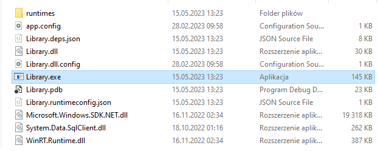

# Library
## Author
Author of this app is Jakub Klonowski (jakubpklonowski@gmail.com).

## Requirements
Technologies used include:
- C# 10;
- .NET 6;
- Windows Forms;
- MS SQL.

## Manual
### Database
Database used for project was MS SQL. Database and tables generation files are included in `sql\` directory. 
Use them in following order:
- create_database.sql
- create_table_book.sql
- create_table_client.sql
- create_table_library.sql

Created tables **will not** be populated with data.

### App
How to run the app:
1. Clone git repo.
1. Recreate database structure according to the manual above.
1. Insert your MS SQL connection string into 3 files in `controllers` catalog .
1. Compile the code with .
1. Open solution catalog and navigate to `bin\Debug\net6.0-windows10.0.17763.0\`, than run `Library.exe` file .
1. Now you can use 3 modules: books, clients, library. Each module allows CRUD operations.

Main app node

Library module

Books module

Clients module

